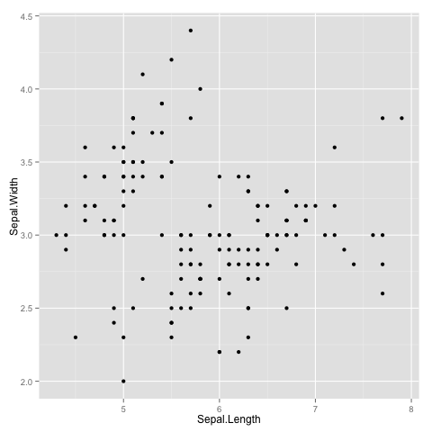

# Jenny's reading of 03_Functions
Jenny Bryan  
`r format(Sys.time(), '%d %B, %Y')`  


Week 02 2014-07-10 we read [Functions](http://adv-r.had.co.nz/Functions.html). Source is found [here on github](https://github.com/hadley/adv-r/blob/master/Functions.rmd).

## Taking the quiz

*I made myself enter these answers before reading the chapter, most especially before reading the answers. I annotated/corrected my original answers as I read on.*

#### What are the three components of a function?

  * the formal arguments
  * the parent environment
  * the function body? return value?
  
*Not bad! "The three components of a function are its body, arguments and environment."*

#### What does the following code return?


```r
y <- 10
f1 <- function(x) {
  function() {
    x + 10
    }
  }
f1(1)()
```
    
Hmmm ... 11? *Correct.*

#### How would you more typically write this code?


```r
`+`(1, `*`(2, 3))
```
    
`(2 * 3) + 1` *Correct.*
    
#### How could you make this call easier to read?


```r
mean(, TRUE, x = c(1:10, NA))
```

`mean(c(1:10, NA), na.rm = TRUE)` *Correct.*

#### Does the following function throw an error when called? Why/why not?


```r
f2 <- function(a, b) {
  a * 10
  }
f2(10, stop("This is an error!"))
```

No, because lazy evaluation implies that `b` will only be evaluated when it comes up in the function. Which it does not. *Correct.*

#### What is an infix function? How do you write it? What's a replacement function? How do you write it?
    
Not sure about the infix thing.

A replacement function requires making an assignment to the `[<-` operator, or something like that.

*Well, he sort of punted on the answer as well and sends the reader to sections on [infix](#infix-functions) and [replacement functions](#replacement-functions). I'll look forward to reading them.*

#### What function do you use to ensure that a cleanup action occurs regardless of how a function terminates?
    
`on.exit()` *Correct. My favorite use of this is when I change working directory in a function (which I try to avoid, but sometimes can't). I immediate call `on.exit()` with instructions to restore the original working directory, so that I don't puzzle myself later with silent changes to working directory.*

## Function components -- Exercises

#### What function allows you to tell if an object is a function? What function allows you to tell if a function is a primitive function?
    

```r
str(sum)
```

```
## function (..., na.rm = FALSE)
```

```r
get("sum")
```

```
## function (..., na.rm = FALSE)  .Primitive("sum")
```

```r
is.function(sum)
```

```
## [1] TRUE
```

```r
is.primitive(sum)
```

```
## [1] TRUE
```

#### Which base function has the most arguments?

He provided this code to list all functions in the base package. 
    

```r
objs <- mget(ls("package:base"), inherits = TRUE)
funs <- Filter(is.function, objs)
```

Here's where I answer the question:

```r
str(funs, max.level = 1, list.len = 6)
```

```
## List of 1167
##  $ -                                 :function (e1, e2)  
##  $ -.Date                            :function (e1, e2)  
##  $ -.POSIXt                          :function (e1, e2)  
##  $ :                                 :.Primitive(":") 
##  $ ::                                :function (pkg, name)  
##  $ :::                               :function (pkg, name)  
##   [list output truncated]
```

```r
n_args <- sapply(funs, function(x) length(formals(x)))
the_one <- which.max(n_args)
names(funs)[the_one]
```

```
## [1] "scan"
```

```r
length(formals(funs[[the_one]]))
```

```
## [1] 22
```
    
#### How many base functions have no arguments? What's special about those functions?
       

```r
table(n_args, useNA = "always")
```

```
## n_args
##    0    1    2    3    4    5    6    7    8    9   10   11   12   14   16 
##  221  192  341  187   85   81   29   12    8    3    2    1    2    1    1 
##   22 <NA> 
##    1    0
```

```r
length(no_args <- which(n_args == 0))
```

```
## [1] 221
```

```r
funs[head(no_args)]
```

```
## $`-`
## function (e1, e2)  .Primitive("-")
## 
## $`:`
## .Primitive(":")
## 
## $`!`
## function (x)  .Primitive("!")
## 
## $`!=`
## function (e1, e2)  .Primitive("!=")
## 
## $`(`
## .Primitive("(")
## 
## $`[`
## .Primitive("[")
```

```r
addmargins(table(n_args, sapply(funs, is.primitive)))
```

```
##       
## n_args FALSE TRUE  Sum
##    0      39  182  221
##    1     192    0  192
##    2     341    0  341
##    3     187    0  187
##    4      85    0   85
##    5      81    0   81
##    6      29    0   29
##    7      12    0   12
##    8       8    0    8
##    9       3    0    3
##    10      2    0    2
##    11      1    0    1
##    12      2    0    2
##    14      1    0    1
##    16      1    0    1
##    22      1    0    1
##    Sum   985  182 1167
```
       
I note they are mostly primitive functions. No one else got a better answer. Not sure what the real answer is here.
       
#### How could you adapt the code to find all primitive functions?


```r
str(prims <-lapply(funs, function(x) if(is.primitive(x)) x else NULL),
    list.len = 6)
```

```
## List of 1167
##  $ -                                 :function (e1, e2)  
##  $ -.Date                            : NULL
##  $ -.POSIXt                          : NULL
##  $ :                                 :.Primitive(":") 
##  $ ::                                : NULL
##  $ :::                               : NULL
##   [list output truncated]
```

```r
prims[sapply(prims, is.null)] <- NULL
str(prims, list.len = 6)
```

```
## List of 182
##  $ -              :function (e1, e2)  
##  $ :              :.Primitive(":") 
##  $ !              :function (x)  
##  $ !=             :function (e1, e2)  
##  $ (              :.Primitive("(") 
##  $ [              :.Primitive("[") 
##   [list output truncated]
```

#### What are the three important components of a function?

Body, environment, arguments.

#### When does printing a function not show what environment it was created in?

When the function was created in the global environment.

## Lexical scoping 

### Dynamic lookup

This is good to know about: `codetools::findGlobals(f)`. Will show your function's external dependencies.

### Exercises

#### What does the following code return? Why? What does each of the three `c`'s mean?


```r
c <- 10
c(c = c)
```

You get a numeric vector with a single element, holding the value 10, named `c`.


```r
c <- 10
c(c = c)
```

```
##  c 
## 10
```

```r
str(c(c = c))
```

```
##  Named num 10
##  - attr(*, "names")= chr "c"
```

#### What are the four principles that govern how R looks for values?

  * name masking
  * functions vs. variables
  * a fresh start
  * dynamic lookup

#### What does the following function return? Make a prediction before running the code yourself.


```r
f <- function(x) {
  f <- function(x) {
    f <- function(x) {
      x ^ 2
      }
    f(x) + 1
    }
  f(x) * 2
  }
f(10)
```
I predict this returns `((10 ^ 2) + 1) * 2 = 202`. And it does.

## Function arguments

Concise statement of how this works: "Arguments are matched first by exact name (perfect matching), then by prefix matching and finally by position."

### Calling a function given a list of arguments

Here's a use of `do.call()` that's good to be reminded of:

"Suppose you had a list of function arguments:"


```r
args <- list(1:10, na.rm = TRUE)
```

"How could you then send that list to `mean()`?  You need `do.call()`:"


```r
do.call(mean, list(1:10, na.rm = TRUE))
```

```
## [1] 5.5
```

```r
# Equivalent to
mean(1:10, na.rm = TRUE)
```

```
## [1] 5.5
```

### Default and missing arguments

The claim is that "Since arguments in R are evaluated lazily (more on that below), the default value can be defined in terms of other arguments". __But then why doesn't this work?__ 


```r
z <- data.frame(x = 1:3, y = x^2)
```

```
## Error: object 'x' not found
```

I'm sure it has to do with function definition (which is what the statement applies to) vs. function invocation (which is what I'm doing), but this still vexes me. Andrew did the below live during discussion. Maybe that's how I can make variables depend on previous variable at the time of data frame creation!


```r
lazy_this <- function(x = 1:3, y = x^2) {
  data.frame(x, y)
}
lazy_this()
```

```
##   x y
## 1 1 1
## 2 2 4
## 3 3 9
```

__UPDATE__: Resolved [here](https://gist.github.com/jennybc/37481d9d784d2e8222b3). TLDR: lazy evalution applies at time of function definition, not invocation.

Good to remember that `missing()` returns a logical re: whether an argument was supplied at call time.

Good to know his strategy when the default value is more involved to compute than your typical default value in a function definition. Here's what he does: "I usually set the default value to NULL and use `is.null()` to check if the argument was supplied".

### Lazy evaluation

Good to know: "If you want to ensure that an argument is evaluated you can use `force`".

*I didn't really understand the example used to illustrate forcing. "At this point, the loop is complete and the final value of x is 10. Therefore all of the adder functions will add 10 on to their input". That confuses me because it seems to conflict with this idea that a fresh copy of a function's environment is created at call time. We will revisit this after we've read about environments.*

*The promise section hasn't totally sunk in yet. At least partially due to lack of examples and use cases. Is this relevant to my life? See if others want to discuss.*

### The `...` argument

Good reminder that "To capture ... in a form that is easier to work with, you can use `list(...)`."

### Exercises

#### Clarify the following list of odd function calls:


```r
## orig
x <- sample(replace = TRUE, 20, x = c(1:10, NA))
## better
sample(c(1:10, NA), size = 20, replace = TRUE)
```


```r
## orig
y <- runif(min = 0, max = 1, 20)
## better
runif(20)
```
Pet peeve of mine: when people specify arguments at their default values. Especially for functions where the defaults are blindingly obvious. It's like crying "Wolf!".


```r
## orig
cor(m = "k", y = y, u = "p", x = x)
## better
cor(x, y, use = "pairwise.complete.obs", method = "kendall")
```
We're computing Kendall's tau statistic for `(x, y)`, as defined in the calling environment, for pairwise complete observations. I believe in spelling out arguments and values that I don't call everyday. The clarity is worth the strenuous typing.

#### What does this function return? Why? Which principle does it illustrate?


```r
f1 <- function(x = {y <- 1; 2}, y = 0) {
  x + y
  }
f1()
```
I predict it will return `(x = 2) + (y = 1 (was 0 to begin)) = 3`. And it does. This illustrates lazy evaluation.

#### What does this function return? Why? Which principle does it illustrate?


```r
f2 <- function(x = z) {
  z <- 100
  x
  }
f2()
```
I predict it will return 100. And it does. Illustrates dynamic lookup and lazy evaluation.   

## Special calls

### Infix functions

Good to know: "All user created infix functions names must start and end with `%` and R comes with the following infix functions predefined: `%%`, `%*%`, `%/%`, `%in%`, `%o%`,  `%x%`. (The complete list of built-in infix operators that don't need `%` is: `::, :::, $, @, ^, *, /, +, -, >, >=, <, <=, ==, !=, !, &, &&, |, ||, ~, <-, <<-`)".

This would be good to discuss further: "There's one infix function that I use very often. It's inspired by Ruby's `||` logical or operator, although it works a little differently in R because Ruby has a more flexible definition of what evaluates to `TRUE` in an if statement. It's useful as a way of providing a default value in case the output of another function is `NULL`:""


```r
`%||%` <- function(a, b) if (!is.null(a)) a else b
function_that_might_return_null() %||% default value
```

What's the use case for this?

### Replacement functions

This is the first place he uses `pryr`, I think. But so far I have not installed and followed along ... maybe I should.

### Exercises

#### Create a list of all the replacement functions found in the base package. Which ones are primitive functions?
   

```r
objs <- mget(ls("package:base"), inherits = TRUE)
funs <- Filter(is.function, objs)
repl_funs <- funs[grepl("<-$", names(funs))]
str(repl_funs, max.level = 1, list.len = 6)
```

```
## List of 34
##  $ [[<-            :.Primitive("[[<-") 
##  $ [<-             :.Primitive("[<-") 
##  $ @<-             :.Primitive("@<-") 
##  $ <-              :.Primitive("<-") 
##  $ <<-             :.Primitive("<<-") 
##  $ $<-             :.Primitive("$<-") 
##   [list output truncated]
```

```r
prim_repl_funs <- Filter(is.primitive, repl_funs)
str(prim_repl_funs, max.level = 1, list.len = 6)
```

```
## List of 17
##  $ [[<-          :.Primitive("[[<-") 
##  $ [<-           :.Primitive("[<-") 
##  $ @<-           :.Primitive("@<-") 
##  $ <-            :.Primitive("<-") 
##  $ <<-           :.Primitive("<<-") 
##  $ $<-           :.Primitive("$<-") 
##   [list output truncated]
```

```r
names(prim_repl_funs)
```

```
##  [1] "[[<-"           "[<-"            "@<-"            "<-"            
##  [5] "<<-"            "$<-"            "attr<-"         "attributes<-"  
##  [9] "class<-"        "dim<-"          "dimnames<-"     "environment<-" 
## [13] "length<-"       "levels<-"       "names<-"        "oldClass<-"    
## [17] "storage.mode<-"
```

#### What are valid names for user created infix functions?

"All user created infix functions names must start and end with `%`".

#### Create an infix `xor()` operator.

First I had to look up what `xor` means. [Wikipedia](http://en.wikipedia.org/wiki/Exclusive_or) did the job. It means "exclusive or". So instead of returning `TRUE` if `x` is `TRUE` or if `y` is `TRUE` or if `x` and `y` are both `TRUE`, the exclusive or requires that *exactly* one of the conditions being considered is `TRUE`.


```r
`%xor%` <- function(x, y) rowSums(cbind(x, y)) == 1
(foo <- data.frame(x = c(TRUE, TRUE, FALSE, FALSE),
                   y = c(TRUE, FALSE, TRUE, FALSE)))
with(foo, data.frame(x, y, test = x %xor% y))
```

*Notes from discussion: I could have just wrapped the pre-existing `xor()` function. Duh. Also Diane suggested a solution based on the simplest thing: `x != y`.*

#### Create infix versions of the set functions `intersect()`, `union()`, and `setdiff()`.


```r
`%isect%` <- function(x, y) x[x %in% y]
`%union%` <- function(x, y) sort(unique(c(x, y)))
`%minus%` <- function(x, y) x[!(x %in% y)]
x <- month.abb[1:6]
y <- month.abb[seq(1, 12, 2)]
x %isect% y
```

```
## [1] "Jan" "Mar" "May"
```

```r
x %union% y # I question the wisdom of how I'm sorting ...
```

```
## [1] "Apr" "Feb" "Jan" "Jul" "Jun" "Mar" "May" "Nov" "Sep"
```

```r
x %minus% y
```

```
## [1] "Feb" "Apr" "Jun"
```
*Note from discussion: Continuing the theme, I could have just wrapped the built-in functions `intersect()`, `union()`, and `setdiff()`.*

#### Create a replacement function that modifies a random location in a vector.


```r
`perturb<-` <- function(x, value) {
  victim <- sample(length(x), 1)
  x[victim] <- value
  return(x)
}
(foo <- month.name)
```

```
##  [1] "January"   "February"  "March"     "April"     "May"      
##  [6] "June"      "July"      "August"    "September" "October"  
## [11] "November"  "December"
```

```r
perturb(foo) <- "Junuary"
foo
```

```
##  [1] "January"   "February"  "March"     "April"     "May"      
##  [6] "June"      "Junuary"   "August"    "September" "October"  
## [11] "November"  "December"
```

## Return values

Hadley says "Generally, I think it’s good style to reserve the use of an explicit `return()` for when you are returning early, such as for an error, or a simple case of the function. This style of programming can also reduce the level of indentation, and generally make functions easier to understand because you can reason about them locally." Two questions:

  * Not sure I agree. Or at least I had thought it was *bad style* to not use an explicit `return()`. It seems easy for the eye to skip over an object name typed on a line alone, i.e. to NOT recognize it for a `return()` statement. It also looks like a print statement leftover from development or maybe a typo? What do others think?
  
The concept of a __pure__ function is useful: "functions that always map the same input to the same output and ... don’t affect the state of the world in any way apart from the value they return."

Separate your pure functions from impure and minimize the creation and use of the latter.

### Exercises

#### How does the `chdir` parameter of `source()` compare to `in_dir()`? Why might you prefer one approach to the other?
    
*Here's the documentation on the `chdir` argument of `source()`: "logical; if `TRUE` and `file` is a pathname, the R working directory is temporarily changed to the directory containing file for evaluating."*

*The modification of working directory that occurs with `in_dir()` is completely free, whereas the modification control by `chdir` of `source()` is very principled: the working directory is set to the directory containing the source file. Freedom is great and all, but I'm more comfortable with `chdir` and `source()`. Constraining the user to do something that seems sensible can help people catch themselves doing bad stuff without meaning to. I have no idea is this is a correct answer.*

#### What function undoes the action of `library()`? How do you save and restore the values of `options()` and `par()`?
    
`detach()` undoes the action of `library()`. *Why is he asking this here??*

Review of good practices for saving and restoring values of `options()` and `par()`:


```r
## in a script
op <- par(new = TRUE)
...
par(op)

## in a function
foo <- function(...) {
  op <- par(new = TRUE)
  on.exit(par(op))
  ...
}
```

#### Write a function that opens a graphics device, runs the supplied code, and closes the graphics device (always, regardless of whether or not the plotting code worked).

This gave me trouble, eventually leading me to write [this Gist](https://gist.github.com/58466fd018823302f398), but it's best to look at [the rendered HTML](http://htmlpreview.github.io/?https://gist.githubusercontent.com/jennybc/58466fd018823302f398/raw/4c7059558e1525b482f1ee794a5828ca8999bf98/2014-07-25_wrapper-graphics-dev-open-close.html). I'm just inserting my clean answer here now.
    

```r
safe_plot <- function(code, file = 'jenny_test.png', ...) {
  png(file = file, ...)
  on.exit(dev.off())
  force(code)
  invisible(NULL)
}
safe_plot({plot(cars)
           abline(coef(lm(dist ~ speed, cars)), col = "purple", lwd = 3)
           })
dev.list()
```

```
## pdf 
##   2
```

```r
safe_plot(plot(flying_cars)) # will not work!
```

```
## Error: object 'flying_cars' not found
```

```r
dev.list()
```

```
## pdf 
##   2
```

```r
safe_plot({require(ggplot2)
           p <- ggplot(iris, aes(x = Sepal.Length, y = Sepal.Width)) +
             geom_point()
           print(p)
           })
```

```
## Loading required package: ggplot2
```

```r
dev.list()
```

```
## pdf 
##   2
```

To prove I really made a plot, I embed the final one here:



#### Consider this alternative version of `capture.output()`.

We can use `on.exit()` to re-implement `capture.output()`.


```r
capture.output2 <- function(code) {
  temp <- tempfile()
  on.exit(file.remove(temp), add = TRUE)
  
  sink(temp)
  on.exit(sink(), add = TRUE)
  
  force(code)
  readLines(temp)
  }
capture.output2(cat("a", "b", "c", sep = "\n"))
```

```
## [1] "a" "b" "c"
```

Compare this function to the real `capture.output()` and think about the simplifications I've made. Is the code easier to understand or harder? Have I removed important functionality?

__NOT DONE YET__  

#### Compare `capture.output()` to `capture.output2()`. How do the functions 
  differ? What features have I removed to make the key ideas easier to see? 
    How have I rewritten the key ideas to be easier to understand?

__NOT DONE YET__  
