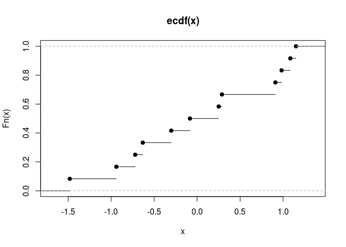

# Andrew -- Functions
Andrew MacDonald  
`r format(Sys.time(), '%d %B, %Y')`  


```r
library(dplyr)
```

```
## 
## Attaching package: 'dplyr'
## 
## The following objects are masked from 'package:stats':
## 
##     filter, lag
## 
## The following objects are masked from 'package:base':
## 
##     intersect, setdiff, setequal, union
```

```r
library(pryr)
```

```
## 
## Attaching package: 'pryr'
## 
## The following object is masked from 'package:dplyr':
## 
##     %.%
```

```r
library(magrittr)
```

```
## 
## Attaching package: 'magrittr'
## 
## The following object is masked from 'package:dplyr':
## 
##     %>%
```

## Excercises

### Given a function, like `"mean"`, `match.fun()` lets you find a function. Given a function, can you find its name? Why doesn't that make sense in R?

Because functions don't need to have any names at all, or could have all kinds of names (including aliases), so I can't even imagine how you'd do that.

###  Use `lapply()` and an anonymous function to find the coefficient of variation (the standard deviation divided by the mean) for all columns in the `mtcars` dataset


```r
sapply(mtcars, function(dat) sd(dat) / mean(dat) )
```

```
##    mpg    cyl   disp     hp   drat     wt   qsec     vs     am   gear 
## 0.3000 0.2886 0.5372 0.4674 0.1487 0.3041 0.1001 1.1520 1.2283 0.2001 
##   carb 
## 0.5743
```

### Use `integrate()` and an anonymous function to find the area under the curve for the following functions. Use [Wolfram Alpha](http://www.wolframalpha.com/) to check your answers.

1. `y = x ^ 2 - x`, x in [0, 10]

```r
integrate(function(x) x ^ 2 - x, 0, 10)
```

```
## 283.3 with absolute error < 3.1e-12
```

1. `y = sin(x) + cos(x)`, x in [-$\pi$, $\pi$]


```r
integrate(function(x) sin(x) + cos(x), - pi, pi)
```

```
## 2.616e-16 with absolute error < 6.3e-14
```
**mathworld says this should be 0.00318531. What went wrong?**

1. `y = exp(x) / x`, x in [10, 20]

```r
integrate(function(x) exp(x) / x, 10, 20)
```

```
## 25613160 with absolute error < 2.8e-07
```
**correct**

### Review your own code

Here is an example of a `magrittr` pipeline with a multiline anonymous function in it. is it horrible?

```
ctrl_single_pair %>% 
  group_by(resp) %>%
  do(anova_ord = aov(val ~ treatment, data = .)) %>%
  function(g) {
    g %>% 
      extract2("anova_ord") %>% 
      set_names(g %>% extract2("resp"))
    } %>%
  lapply(TukeyHSD) %>%
  lapply(function(x) x[["treatment"]]) %>%
  lapply(as.data.frame) %>%
  lapply(function(x) data.frame(comparison = row.names(x),x)) %>%
  function(m) {
    comps <- rbind_all(m)
    r <- names(m) %>% rep(times = sapply(m,nrow) %>% as.numeric)
    data.frame(r,comps)
    } %>% 
  select(response = r, comparison:p.adj) %>%
  mutate(response = response %>% as.character %>% trtnames[.]) %>%
  xtable %>% 
  print(include.rownames = FALSE, size = 8, comment = FALSE)
```

## Exercises 2
  
### Why are functions created by other functions called closures? 
Because they *enclose* the environment in which they were created

### What does the following statistical function do? What would be a better name for it? (The existing name is a bit of a hint.)


```r
bc <- function(lambda) {
  if (lambda == 0) {
    function(x) log(x)
    } else {
      function(x) (x ^ lambda - 1) / lambda
      }
  }
```

the function `bc` is a function factory that has a single argument, `lambda`. it either returns the function `log(x)` (if `lambda` is 0) or the polynomial `(x ^ lambda - 1) / lambda` otherwise.  
Some creative Googling reveals that this is the [Box-Cox Transformation](http://onlinestatbook.com/2/transformations/box-cox.html), so I'd probably call this function `box_cox`.

### What does `approxfun()` do? What does it return?

```r
#?approxfun
```
`approxfun` creates a closure function which remembers the data on which `approxfun` was called. This function interpolates the data that was used to create it. Neat!

### What does `ecdf()` do? What does it return?
`ecdf()` is the empirical cumulative distribution function, which I'm going to guess is also a function factory that makes a closure:

```r
x <- rnorm(12)
Fn <- ecdf(x)
is.function(Fn) # it's a function!
```

```
## [1] TRUE
```

```r
plot(Fn)
```

 

### Create a function that creates functions that compute the ith central moment of a numeric vector.


```r
moment <- function(i){
  function(x) {
    mean((x - mean(x)) ^ i)
    }
  }
```

Test it out


```r
m1 <- moment(1)
m2 <- moment(2)

x <- runif(100)
stopifnot(all.equal(m1(x), 0))
stopifnot(all.equal(m2(x), var(x) * 99 / 100))
```

### Create a function pick() that takes an index, i, as an argument and returns a function with an argument x that subsets x with i.


```r
pick <- function(index) function(x) x[[index]]

all.equal(lapply(mtcars, pick(5)),
          lapply(mtcars, function(x) x[[5]]))
```

```
## [1] TRUE
```

## Exercises 3
### Implement a summary function that works like base::summary(), but uses a list of functions.
I assume we are making a version of `summary` as it works on data.frames : 

```r
summary(iris)
```

```
##   Sepal.Length   Sepal.Width    Petal.Length   Petal.Width 
##  Min.   :4.30   Min.   :2.00   Min.   :1.00   Min.   :0.1  
##  1st Qu.:5.10   1st Qu.:2.80   1st Qu.:1.60   1st Qu.:0.3  
##  Median :5.80   Median :3.00   Median :4.35   Median :1.3  
##  Mean   :5.84   Mean   :3.06   Mean   :3.76   Mean   :1.2  
##  3rd Qu.:6.40   3rd Qu.:3.30   3rd Qu.:5.10   3rd Qu.:1.8  
##  Max.   :7.90   Max.   :4.40   Max.   :6.90   Max.   :2.5  
##        Species  
##  setosa    :50  
##  versicolor:50  
##  virginica :50  
##                 
##                 
## 
```


```r
## make a list of functions
funs <- list(
  "Min." = min,
  "1st Qu." = function(x) quantile(x, probs = 0.25),
  "Median" = median,
  "Mean" = mean,
  "3rd Qu" =  function(x) quantile(x, probs = 0.75),
  "Max." = max)

summary_andrew <- function(flist = funs){
  function(data) {
    lapply(data, function(d) sapply(flist, function(f) f(d)))
  }
  }
## do that list to each element of a dataframe/ list
summary_andrew()(mtcars)
```

```
## $mpg
##        Min. 1st Qu..25%      Median        Mean  3rd Qu.75%        Max. 
##       10.40       15.43       19.20       20.09       22.80       33.90 
## 
## $cyl
##        Min. 1st Qu..25%      Median        Mean  3rd Qu.75%        Max. 
##       4.000       4.000       6.000       6.188       8.000       8.000 
## 
## $disp
##        Min. 1st Qu..25%      Median        Mean  3rd Qu.75%        Max. 
##        71.1       120.8       196.3       230.7       326.0       472.0 
## 
## $hp
##        Min. 1st Qu..25%      Median        Mean  3rd Qu.75%        Max. 
##        52.0        96.5       123.0       146.7       180.0       335.0 
## 
## $drat
##        Min. 1st Qu..25%      Median        Mean  3rd Qu.75%        Max. 
##       2.760       3.080       3.695       3.597       3.920       4.930 
## 
## $wt
##        Min. 1st Qu..25%      Median        Mean  3rd Qu.75%        Max. 
##       1.513       2.581       3.325       3.217       3.610       5.424 
## 
## $qsec
##        Min. 1st Qu..25%      Median        Mean  3rd Qu.75%        Max. 
##       14.50       16.89       17.71       17.85       18.90       22.90 
## 
## $vs
##        Min. 1st Qu..25%      Median        Mean  3rd Qu.75%        Max. 
##      0.0000      0.0000      0.0000      0.4375      1.0000      1.0000 
## 
## $am
##        Min. 1st Qu..25%      Median        Mean  3rd Qu.75%        Max. 
##      0.0000      0.0000      0.0000      0.4062      1.0000      1.0000 
## 
## $gear
##        Min. 1st Qu..25%      Median        Mean  3rd Qu.75%        Max. 
##       3.000       3.000       4.000       3.688       4.000       5.000 
## 
## $carb
##        Min. 1st Qu..25%      Median        Mean  3rd Qu.75%        Max. 
##       1.000       2.000       2.000       2.812       4.000       8.000
```
Is there a pretty way to use `mapply` here ?

### Which of the following commands is equivalent to with(x, f(z))?
c, unless you've attached it (in which case it would be d) so I guess e

## Exercises 4

### Instead of creating individual functions (e.g., midpoint(), trapezoid(), simpson(), etc.), we could store them in a list. If we did that, how would that change the code? Can you create the list of functions from a list of coefficients for the Newton-Cotes formulae?

First, run all of Hadley's functions : 

```r
midpoint <- function(f, a, b) {
  (b - a) * f((a + b) / 2)
}

trapezoid <- function(f, a, b) {
  (b - a) / 2 * (f(a) + f(b))
}

midpoint(sin, 0, pi)
```

```
## [1] 3.142
```

```r
#> [1] 3.141593
trapezoid(sin, 0, pi)
```

```
## [1] 1.924e-16
```

```r
#> [1] 1.923671e-16

composite <- function(f, a, b, n = 10, rule) {
  points <- seq(a, b, length = n + 1)

  area <- 0
  for (i in seq_len(n)) {
    area <- area + rule(f, points[i], points[i + 1])
  }

  area
}

composite(sin, 0, pi, n = 10, rule = midpoint)
```

```
## [1] 2.008
```

```r
#> [1] 2.008248
composite(sin, 0, pi, n = 10, rule = trapezoid)
```

```
## [1] 1.984
```

```r
simpson <- function(f, a, b) {
  (b - a) / 6 * (f(a) + 4 * f((a + b) / 2) + f(b))
}

boole <- function(f, a, b) {
  pos <- function(i) a + i * (b - a) / 4
  fi <- function(i) f(pos(i))

  (b - a) / 90 *
    (7 * fi(0) + 32 * fi(1) + 12 * fi(2) + 32 * fi(3) + 7 * fi(4))
}

composite(sin, 0, pi, n = 10, rule = simpson)
```

```
## [1] 2
```

```r
#> [1] 2.000007
composite(sin, 0, pi, n = 10, rule = boole)
```

```
## [1] 2
```

```r
#> [1] 2


newton_cotes <- function(coef, open = FALSE) {
  n <- length(coef) + open

  function(f, a, b) {
    pos <- function(i) a + i * (b - a) / n
    points <- pos(seq.int(0, length(coef) - 1))

    (b - a) / sum(coef) * sum(f(points) * coef)
  }
}

boole <- newton_cotes(c(7, 32, 12, 32, 7))
milne <- newton_cotes(c(2, -1, 2), open = TRUE)
composite(sin, 0, pi, n = 10, rule = milne)
```

```
## [1] 1.994
```

```r
#> [1] 1.993829
```

Now we can put all the premade functions in a list, and run an anonymous wrapper for `composite()` over it:


```r
rulelist <- list(
  midpoint = midpoint,
  trapezoid = trapezoid,
  simpson = simpson,
  boole = boole
  )

lapply(rulelist, function(r) composite(sin, 0, pi, n = 10, rule = r))
```

```
## $midpoint
## [1] 2.008
## 
## $trapezoid
## [1] 1.984
## 
## $simpson
## [1] 2
## 
## $boole
## [1] 2.002
```

Are they really different speeds?


```r
rulerunner <- function(listrule) {
  force(listrule)
  function() composite(sin, 0, pi, n = 10, rule = listrule)
  }

library(microbenchmark)

lapply(rulelist, rulerunner) %>%
  microbenchmark(list = .)
```

```
## Unit: nanoseconds
##       expr min lq median uq   max neval
##   midpoint   5  6    6.0  8   209   100
##  trapezoid   5  6    6.5  7    82   100
##    simpson   5  6    7.0  8 40638   100
##      boole   5  6    7.0  8    75   100
```

#### making a list from the newton-cotes formula


```r
1:5 %>%
  lapply(function(x) {
    force(x) 
    newton_cotes(coef = x)
    }) %>%
  lapply(rulerunner) %>%
  lapply(function(f) f())
```

```
## [[1]]
## [1] 1.984
## 
## [[2]]
## [1] 1.984
## 
## [[3]]
## [1] 1.984
## 
## [[4]]
## [1] 1.984
## 
## [[5]]
## [1] 1.984
```


