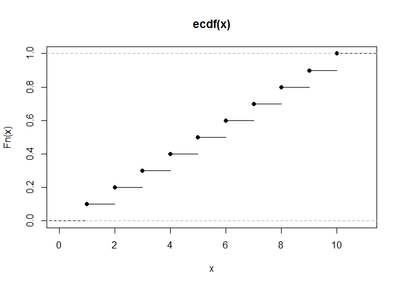

# Functional Programming!!!
Alathea  
2014-08-20  

## Exercises

### Given a function, like `mean`, `match.fun()` lets you find a function. Given a function, can you find its name? Why doesn’t that make sense in R?

1) A function may not have a name, and
2) a function does not have a `name` attribute.

### Use `lapply()` and an anonymous function to find the coefficient of variation (the standard deviation divided by the mean) for all columns in the `mtcars` dataset.


```r
cv <- lapply(mtcars, function(x) sd(x)/mean(x))
data.frame(cv)
```

```
##   mpg    cyl   disp     hp   drat     wt   qsec    vs    am   gear   carb
## 1 0.3 0.2886 0.5372 0.4674 0.1487 0.3041 0.1001 1.152 1.228 0.2001 0.5743
```

### Use `integrate()` and an anonymous function to find the area under the curve for the following functions. Use Wolfram Alpha to check your answers.

> y = x ^ 2 - x, x in [0, 10]
>
> y = sin(x) + cos(x), x in [-p, p]
>
> y = exp(x) / x, x in [10, 20]


```r
integrate(function(x) x^2 - x, 0, 10)
```

```
## 283.3 with absolute error < 3.1e-12
```

```r
integrate(function(x) sin(x) + cos(x), -pi, pi)
```

```
## 2.616e-16 with absolute error < 6.3e-14
```

```r
integrate(function(x) exp(x)/x, 10, 20)
```

```
## 25613160 with absolute error < 2.8e-07
```

### A good rule of thumb is that an anonymous function should fit on one line and shouldn’t need to use `{}`. Review your code. Where could you have used an anonymous function instead of a named function? Where should you have used a named function instead of an anonymous function?

### Why are functions created by other functions called closures?

Why does Hadley think I know that?

### What does the following statistical function do? What would be a better name for it? (The existing name is a bit of a hint.)


```r
bc <- function(lambda) {
  if (lambda == 0) {
    function(x) log(x)
  } else {
    function(x) (x ^ lambda - 1) / lambda
  }
}
```

### What does `approxfun()` do? What does it return?

It returns a function that will produce the linear interpolation of  a set of points.


```r
x <- c(1:10)
y <- c(11:20)

approx(x, y)
```

```
## $x
##  [1]  1.000  1.184  1.367  1.551  1.735  1.918  2.102  2.286  2.469  2.653
## [11]  2.837  3.020  3.204  3.388  3.571  3.755  3.939  4.122  4.306  4.490
## [21]  4.673  4.857  5.041  5.224  5.408  5.592  5.776  5.959  6.143  6.327
## [31]  6.510  6.694  6.878  7.061  7.245  7.429  7.612  7.796  7.980  8.163
## [41]  8.347  8.531  8.714  8.898  9.082  9.265  9.449  9.633  9.816 10.000
## 
## $y
##  [1] 11.00 11.18 11.37 11.55 11.73 11.92 12.10 12.29 12.47 12.65 12.84
## [12] 13.02 13.20 13.39 13.57 13.76 13.94 14.12 14.31 14.49 14.67 14.86
## [23] 15.04 15.22 15.41 15.59 15.78 15.96 16.14 16.33 16.51 16.69 16.88
## [34] 17.06 17.24 17.43 17.61 17.80 17.98 18.16 18.35 18.53 18.71 18.90
## [45] 19.08 19.27 19.45 19.63 19.82 20.00
```

```r
approxfun(x, y)
```

```
## function (v) 
## .approxfun(x, y, v, method, yleft, yright, f)
## <bytecode: 0x0000000007753168>
## <environment: 0x0000000007753a38>
```

### What does `ecdf()` do? What does it return?

It returns the cumulative distribution function for a distribution.


```r
x <- c(1:10)
ecdf(x)
```

```
## Empirical CDF 
## Call: ecdf(x)
##  x[1:10] =   1,   2,   3,  ...,   9,  10
```

```r
plot(ecdf(x))
```

 

### Create a function that creates functions that compute the ith central moment of a numeric vector. You can test it by running the following code:


```r
m1 <- moment(1)
m2 <- moment(2)

x <- runif(100)
stopifnot(all.equal(m1(x), 0))
stopifnot(all.equal(m2(x), var(x) * 99 / 100))
```

### Create a function `pick()` that takes an index, `i`, as an argument and returns a function with an argument `x` that subsets `x` with `i`.


```r
lapply(mtcars, pick(5))
# should do the same as this
lapply(mtcars, function(x) x[[5]])
```


```r
pick <- function(index)
{
  function(x) x[[index]]
}

pick5 <- lapply(mtcars, pick(5))
data.frame(pick5)
```

### Implement a summary function that works like `base::summary()`, but uses a list of functions. Modify the function so it returns a closure, making it possible to use it as a function factory.

I half don't understand this question.  I also didn't duplicate the whole summary because I got bored.


```r
x <- c(1:10)
y <- runif(10)

fit <- lm(y ~ x)
summary(fit)
```

```
## 
## Call:
## lm(formula = y ~ x)
## 
## Residuals:
##     Min      1Q  Median      3Q     Max 
## -0.4746 -0.2289 -0.0436  0.2246  0.5522 
## 
## Coefficients:
##             Estimate Std. Error t value Pr(>|t|)   
## (Intercept)   0.8540     0.2304    3.71    0.006 **
## x            -0.0647     0.0371   -1.74    0.120   
## ---
## Signif. codes:  0 '***' 0.001 '**' 0.01 '*' 0.05 '.' 0.1 ' ' 1
## 
## Residual standard error: 0.337 on 8 degrees of freedom
## Multiple R-squared:  0.275,	Adjusted R-squared:  0.184 
## F-statistic: 3.03 on 1 and 8 DF,  p-value: 0.12
```

```r
my_summary <- list(
    resid_min = function(x) min(x$residuals),
    resid_median = function(x) median(x$residuals),
    resid_max = function(x) max(x$residuals),
    resid_se = function(x) sd(x$residuals)/length(x$residuals),
    resid_df = function(x) x$df.residual
)

lapply(my_summary, function(f) f(fit))
```

```
## $resid_min
## [1] -0.4746
## 
## $resid_median
## [1] -0.04357
## 
## $resid_max
## [1] 0.5522
## 
## $resid_se
## [1] 0.0318
## 
## $resid_df
## [1] 8
```

### Which of the following commands is equivalent to `with(x, f(z))`?
1. x\$f(x\$z).
2. f(x$z).
3. x$f(z).
4. f(z).
5. It depends.

It depends on what you have defined where.  Most likely #3.

### Instead of creating individual functions (e.g., `midpoint()`, `trapezoid()`, `simpson()`, etc.), we could store them in a list. If we did that, how would that change the code? Can you create the list of functions from a list of coefficients for the Newton-Cotes formulae?


```r
newton_cotes <- function(coef, open = FALSE) {
  n <- length(coef) + open

  function(f, a, b) {
    pos <- function(i) a + i * (b - a) / n
    points <- pos(seq.int(0, length(coef) - 1))

    (b - a) / sum(coef) * sum(f(points) * coef)
  }
}


get_rules <- function()
{
  coeffs <- list(closed = list(trapezoid_c = c(1,1),
                               simpson = c(1,4,1),
                               simpson38 = c(1,3,3,1),
                               boole = c(7,32,12,32,7)),
                 open = list(midpoint = c(1),
                             trapezoid_o = c(1,1),
                             milne = c(2,-1,2),
                             no_name = c(11,1,1,11)))

  rules_closed <- lapply(coeffs$closed, function(x) newton_cotes(x))
  rules_open <- lapply(coeffs$open, function(x) newton_cotes(x, open = TRUE))
  
  c(rules_closed, rules_open)
}

compose_function <- function(rule)
{
  function(f, a, b, n = 10) {
    points <- seq(a, b, length = n + 1)
  
    area <- 0
    for (i in seq_len(n)) {
      area <- area + rule(f, points[i], points[i + 1])
    }
  
    area
  }
}

rules <- get_rules()
integration_funs <- lapply(rules, function(x) compose_function(x))
```

Now you can `lapply` the list of functions to whichever values you want. e.g.


```r
areas <- lapply(integration_funs, function(f) f(sin, 0, pi))
data.frame(areas)
```

```
##   trapezoid_c simpson simpson38 boole midpoint trapezoid_o milne no_name
## 1       1.996   1.996     1.996 1.996    1.996       1.996 1.996   1.996
```

### The trade-off between integration rules is that more complex rules are slower to compute, but need fewer pieces. For `sin()` in the range `[0, p]`, determine the number of pieces needed so that each rule will be equally accurate. Illustrate your results with a graph. How do they change for different functions? `sin(1 / x^2)` is particularly challenging.


***
***

## Discussion Notes

Exercise #2 = Box-Cox transformation.

***
***

## Reading Notes

### Motivation

The three building blocks of functional programming are:

* anonymous functions
* closures (functions written by functions)
* lists of functions

**functionals**: they take a function as an argument

### Anonymous functions

functions without a name

### Closures

function within a function.  these can often be anonymous

#### Function factories are cool

#### Mutable state

> What happens if you don’t use a closure? What happens if you use <- instead of <<-? Make predictions about what will happen if you replace `new_counter()` with the variants below, then run the code and check your predictions.


```r
i <- 0
new_counter2 <- function() {
  i <<- i + 1
  i
}
```

In `new_counter2()`, you cannot use separate instances of the counter because they modify `i` in the parent environment.  So, if you create more than one `new_counter2()`, the counter will be messed up because each one changes the same object `i`.


```r
new_counter3 <- function() {
  i <- 0
  function() {
    i <- i + 1
    i
  }
}
```

Every time `new_counter3()` is called, `i` is reset to `0`.  Since you are using the `<-` instead of `<<-`, the sub-function does not modify the original value of `i` so it reads in `i <- 0` on each call.

#### Lists of functions

`lapply` can be used to call each item in a list of functions.  e.g. `lapply(compute_mean, function(f) f(x))`

a list of functions can be used to summarize a data set in multiple ways, (e.g. take the mean, median, standard deviation... etc. all at once)

`lapply` can also be used to send an extra argument to each function in the list, e.g. `lapply(funs, function(f) f(x, na.rm = TRUE))`
