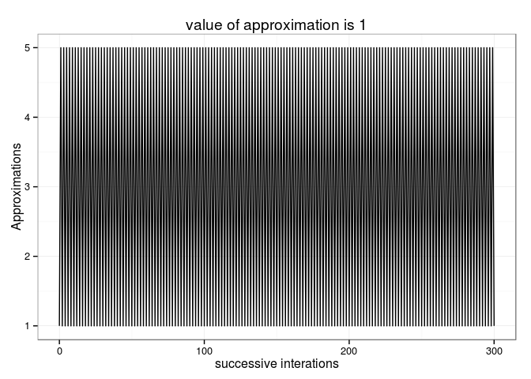
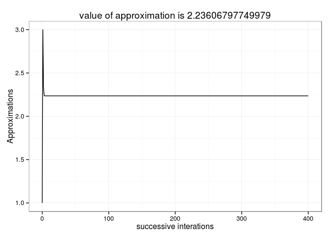
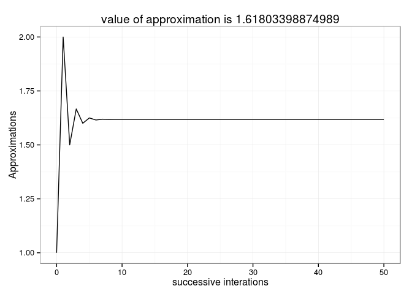

# Andrew_Functionals
Andrew MacDonald  
`r format(Sys.time(), '%d %B, %Y')`  


```r
knitr::opts_chunk$set(error = TRUE, cache = TRUE)
library(ggplot2)
library(tidyr)
library(magrittr)
```

```
## 
## Attaching package: 'magrittr'
## 
## The following object is masked from 'package:tidyr':
## 
##     extract
```


## Exercises 1
### Why are the following two invocations of `lapply()` equivalent?
Because the first element of `mean()` gets interpreted as the value of `trim` **IF** the value of x is already supplied.


```r
mean(0.5, x = c(0:10,50))
```

```
## [1] 5.5
```

### The function below scales a vector so it falls in the range [0, 1]. How would you apply it to every column of a data frame? How would you apply it to every numeric column in a data frame?


```r
scale01 <- function(x) {
  rng <- range(x, na.rm = TRUE)
  (x - rng[1]) / (rng[2] - rng[1])
}

mtcars_scale <- mtcars[]
mtcars_scale[] <- lapply(mtcars, scale01)
head(mtcars_scale)
```

```
##                      mpg cyl    disp     hp   drat     wt   qsec vs am
## Mazda RX4         0.4511 0.5 0.22175 0.2049 0.5253 0.2830 0.2333  0  1
## Mazda RX4 Wag     0.4511 0.5 0.22175 0.2049 0.5253 0.3482 0.3000  0  1
## Datsun 710        0.5277 0.0 0.09204 0.1449 0.5023 0.2063 0.4893  1  1
## Hornet 4 Drive    0.4681 0.5 0.46620 0.2049 0.1475 0.4352 0.5881  1  0
## Hornet Sportabout 0.3532 1.0 0.72063 0.4346 0.1797 0.4927 0.3000  0  0
## Valiant           0.3277 0.5 0.38389 0.1873 0.0000 0.4978 0.6810  1  0
##                   gear   carb
## Mazda RX4          0.5 0.4286
## Mazda RX4 Wag      0.5 0.4286
## Datsun 710         0.5 0.0000
## Hornet 4 Drive     0.0 0.0000
## Hornet Sportabout  0.0 0.1429
## Valiant            0.0 0.0000
```

```r
scale_numerics <- function(dat){
  if(is.numeric(dat)){
    scale01(dat)
    } else {
      dat
      }
  }

iris_scale <- iris

iris_scale[] <- lapply(iris, scale_numerics)

head(iris)
```

```
##   Sepal.Length Sepal.Width Petal.Length Petal.Width Species
## 1          5.1         3.5          1.4         0.2  setosa
## 2          4.9         3.0          1.4         0.2  setosa
## 3          4.7         3.2          1.3         0.2  setosa
## 4          4.6         3.1          1.5         0.2  setosa
## 5          5.0         3.6          1.4         0.2  setosa
## 6          5.4         3.9          1.7         0.4  setosa
```

```r
try(lapply(iris, scale01))
```

### Use both for loops and `lapply()` to fit linear models to the mtcars using the formulas stored in this list:


```r
formulas <- list(
  mpg ~ disp,
  mpg ~ I(1 / disp),
  mpg ~ disp + wt,
  mpg ~ I(1 / disp) + wt
)

mods <- vector("list", length(formulas))

for (i in seq_along(formulas)){
  mods[[i]] <- lm(formulas[[i]], data = mtcars)
  }
```

The `lapply()` method is interesting. normally I would use an anonymous function, but I learned from the examples in this chapter that this is not actually necessary:


```r
models_mtcars <- lapply(formulas, lm, data = mtcars)
# old way
#lapply(formulas, function(form) lm(form, data = mtcars))
```


### Fit the model `mpg ~ disp` to each of the bootstrap replicates of mtcars in the list below by using a for loop and `lapply()`. Can you do it without an anonymous function?


```r
bootstraps <- lapply(1:10, function(i) {
  rows <- sample(1:nrow(mtcars), rep = TRUE)
  mtcars[rows, ]
})

## for loop

bootstrap_models <- vector("list",length(bootstraps))
for(i in seq_along(bootstraps)){
  bootstrap_models[[i]] <- lm(mpg ~ disp, data = bootstraps[[i]])
  }

## lapply

bootstrap_models_lapply <- lapply(bootstraps, lm, formula = mpg ~ disp)
```

I must say, although I love this approach (avoiding anonymous functions) because of its simple elegance, I have my doubts.  It strikes me as both harder to read and error prone.  Harder to read, because your reader might not remember/know that `data` is the second argument to `lm()` (I had to check, and I've been doing this for years). Error-prone, because you might inadvertently pass the list elements to the wrong argument, and not immediately realize your mistake.

### For each model in the previous two exercises, extract R2 using the function below.


```r
rsq <- function(mod) summary(mod)$r.squared

sapply(bootstrap_models_lapply, rsq)
```

```
##  [1] 0.8138 0.6447 0.7372 0.6678 0.7710 0.6953 0.6647 0.6879 0.8330 0.7664
```

```r
sapply(models_mtcars, rsq)
```

```
## [1] 0.7183 0.8597 0.7809 0.8838
```

### Use vapply() to Compute the standard deviation of every column in a numeric data frame.


```r
species_abundances <- sample(seq_len(100),size = 5) %>%
  sapply(rpois, n = 20) %>%
  data.frame %>%
  set_names(paste0("sp",1:5))

vapply(species_abundances, sd, numeric(1))
```

```
##   sp1   sp2   sp3   sp4   sp5 
## 6.924 8.499 3.407 8.055 8.486
```

### Compute the standard deviation of every numeric column in a mixed data frame. (Hint: you’ll need to use vapply() twice.)


```r
library(dplyr)
site_species <- species_abundances %>% 
  mutate(site = paste0("site",LETTERS[1:5]) %>%
           rep(times = 4))

vapply(site_species[vapply(site_species, is.numeric, logical(1))], sd, numeric(1))
```

```
##   sp1   sp2   sp3   sp4   sp5 
## 6.924 8.499 3.407 8.055 8.486
```

```r
## Equivalently, in magrittr style:
site_species %>%
  vapply(is.numeric, logical(1)) %>%
  site_species[.] %>%
  vapply(sd, numeric(1))
```

```
##   sp1   sp2   sp3   sp4   sp5 
## 6.924 8.499 3.407 8.055 8.486
```


### Why is using sapply() to get the class() of each element in a data frame dangerous?
Because many elements will have >1 classes, and`sapply` will silently return a list (you probably wanted a vector, or you would have just used `lapply` directly).

### Use sapply() and an anonymous function to extract the p-value from every trial.


```r
trials <- replicate(
  100, 
  t.test(rpois(10, 10), rpois(7, 10)),
  simplify = FALSE
)

sapply(trials, function(test) test$p.value)
```

```
##   [1] 0.97257 0.45189 0.23822 0.26346 0.04623 0.58196 0.23277 0.88600
##   [9] 0.59023 0.04353 0.09124 0.51152 0.17858 0.48380 0.54696 0.73133
##  [17] 0.06745 0.36419 0.38846 0.75181 0.30184 0.02481 0.91555 0.53430
##  [25] 0.12492 0.53463 0.52985 0.84937 0.71311 0.72263 0.67798 0.09643
##  [33] 0.52782 1.00000 0.78422 0.14096 0.38059 0.89714 0.36100 0.01793
##  [41] 0.80433 0.47471 0.33630 0.47749 0.21436 0.91552 0.27927 0.74218
##  [49] 0.32426 0.55587 0.62914 0.16646 0.48577 0.50520 0.58067 0.24738
##  [57] 0.98565 0.34761 0.23370 0.56015 0.84444 0.10809 0.10662 0.76039
##  [65] 0.57727 0.02724 0.90796 0.27806 0.70234 0.66454 0.56424 0.62344
##  [73] 0.40202 0.01187 0.40885 0.62757 0.77142 0.63220 0.86243 0.04552
##  [81] 0.57413 0.73691 0.48918 0.34185 0.34151 0.73691 0.07798 0.19122
##  [89] 0.19771 0.57993 0.82327 0.58516 0.80013 0.65280 0.12803 0.41009
##  [97] 0.06378 0.03939 0.56994 0.10926
```

```r
sapply(trials, '[[', i = "p.value") 
```

```
##   [1] 0.97257 0.45189 0.23822 0.26346 0.04623 0.58196 0.23277 0.88600
##   [9] 0.59023 0.04353 0.09124 0.51152 0.17858 0.48380 0.54696 0.73133
##  [17] 0.06745 0.36419 0.38846 0.75181 0.30184 0.02481 0.91555 0.53430
##  [25] 0.12492 0.53463 0.52985 0.84937 0.71311 0.72263 0.67798 0.09643
##  [33] 0.52782 1.00000 0.78422 0.14096 0.38059 0.89714 0.36100 0.01793
##  [41] 0.80433 0.47471 0.33630 0.47749 0.21436 0.91552 0.27927 0.74218
##  [49] 0.32426 0.55587 0.62914 0.16646 0.48577 0.50520 0.58067 0.24738
##  [57] 0.98565 0.34761 0.23370 0.56015 0.84444 0.10809 0.10662 0.76039
##  [65] 0.57727 0.02724 0.90796 0.27806 0.70234 0.66454 0.56424 0.62344
##  [73] 0.40202 0.01187 0.40885 0.62757 0.77142 0.63220 0.86243 0.04552
##  [81] 0.57413 0.73691 0.48918 0.34185 0.34151 0.73691 0.07798 0.19122
##  [89] 0.19771 0.57993 0.82327 0.58516 0.80013 0.65280 0.12803 0.41009
##  [97] 0.06378 0.03939 0.56994 0.10926
```

### What does replicate() do? What sort of for loop does it eliminate? Why do its arguments differ from lapply() and friends?

replicate is just sapply run over a vector of length `n` (first arg), that evaluates an expression once for each element and then simplifies the result.  
It eliminates for loops which just repeatedly evaluate an expression. Usually for random numbers; I can't think of a reason to use `replicate()` if something isn't random.
The second argument of `replicate()` isn't a function, it's an expression.  That's because it isn't actually *doing* anything with the vector of numbers, unlike the apply family.


```r
replicate(5, rnorm(2))
```

```
##        [,1]    [,2]    [,3]    [,4]    [,5]
## [1,] -2.046 -0.5344  0.7641  2.4988  0.7972
## [2,] -1.808  0.1348 -0.3306 -0.6837 -0.9613
```

```r
replicate(4, "blue")
```

```
## [1] "blue" "blue" "blue" "blue"
```


### Implement a version of lapply() that supplies FUN with both the name and the value of each component.

Not exactly sure what is meant by "component" here, but here goes:


```r
colnum <- c("blue" = 2, "green" = 7)

lapply(colnum, function(x) x/2)
```

```
## $blue
## [1] 1
## 
## $green
## [1] 3.5
```

ahh, it actually requires a `Map` or mapply solution!

```r
name_val_lapply <- function(X, FUN, ...){
 Map(FUN, names(X), X, ...)
}

funtest <- function(name_of, val_of){
  paste("the value of", name_of, "is", val_of)
}

name_val_lapply(colnum, funtest)
```

```
## $blue
## [1] "the value of blue is 2"
## 
## $green
## [1] "the value of green is 7"
```

### Implement a combination of Map() and vapply() to create an lapply() variant that iterates in parallel over all of its inputs and stores its outputs in a vector (or a matrix). What arguments should the function take?

I am hazy about what is going on here.  IN fact, rereading this section after looking at this question suggests to me that there are two different uses of the word "parallel" going on here: one refers to sending computations to different cores, and the other to the "zipper" action of `Map` | `mapply`.  not sure what do to here?


### Implement mcsapply(), a multicore version of sapply(). Can you implement mcvapply(), a parallel version of vapply()? Why or why not?

my intuition is that `mcvapply` is impossible, since it allocates the vector first and how can you do that with parallel? you probably can't.

In the cheapest move ever, I implement sapply by taking the guts of sapply and changing lapply to mclapply:

```r
library(parallel)

mcsapply <- function (X, FUN, ..., simplify = TRUE, USE.NAMES = TRUE) 
  {
  FUN <- match.fun(FUN)
  answer <- mclapply(X = X, FUN = FUN, mc.cores = 2, ...)
  if (USE.NAMES && is.character(X) && is.null(names(answer))) 
    names(answer) <- X
  if (!identical(simplify, FALSE) && length(answer)) 
    simplify2array(answer, higher = (simplify == "array"))
  else answer
  }

##pokey example
boot_df <- function(x) x[sample(nrow(x), rep = T), ]
rsquared <- function(mod) summary(mod)$r.square
boot_lm <- function(i) {
  rsquared(lm(mpg ~ wt + disp, data = boot_df(mtcars)))
}


library(microbenchmark)

## this doesn't actually speed anything up
if(FALSE){
microbenchmark(sapply(1:10, boot_lm),
               mcsapply(1:10, boot_lm))
}
```


## Matrix functionals

### How does apply() arrange the output? Read the documentation and perform some experiments.


```r
mat <- matrix(rnorm(20), nrow = 5)

apply(mat, 1, summary)
```

```
##            [,1]    [,2]    [,3]   [,4]    [,5]
## Min.    -1.8200 -2.1200 -0.7800 -0.268 -1.7100
## 1st Qu. -0.8570 -1.2100 -0.6690  0.178  0.0262
## Median  -0.5180 -0.0556 -0.3150  0.402  0.7800
## Mean    -0.6970 -0.3550 -0.3030  0.469  0.2330
## 3rd Qu. -0.3590  0.7980  0.0518  0.694  0.9860
## Max.     0.0633  0.8110  0.1990  1.340  1.0800
```

```r
apply(mat, 2, summary)
```

```
##           [,1]   [,2]    [,3]     [,4]
## Min.    -1.820 -2.120 -0.7800 -1.71000
## 1st Qu. -0.633 -0.537  0.0633 -0.90500
## Median   0.477 -0.268  0.8110 -0.50000
## Mean    -0.115 -0.330  0.4780 -0.55600
## 3rd Qu.  0.604  0.199  0.9560  0.00273
## Max.     0.794  1.080  1.3400  0.32600
```

```r
apply(mtcars, 2, summary)
```

```
##          mpg  cyl  disp    hp drat   wt qsec    vs    am gear carb
## Min.    10.4 4.00  71.1  52.0 2.76 1.51 14.5 0.000 0.000 3.00 1.00
## 1st Qu. 15.4 4.00 121.0  96.5 3.08 2.58 16.9 0.000 0.000 3.00 2.00
## Median  19.2 6.00 196.0 123.0 3.70 3.32 17.7 0.000 0.000 4.00 2.00
## Mean    20.1 6.19 231.0 147.0 3.60 3.22 17.8 0.438 0.406 3.69 2.81
## 3rd Qu. 22.8 8.00 326.0 180.0 3.92 3.61 18.9 1.000 1.000 4.00 4.00
## Max.    33.9 8.00 472.0 335.0 4.93 5.42 22.9 1.000 1.000 5.00 8.00
```

### There’s no equivalent to split() + vapply(). Should there be? When would it be useful? Implement one yourself.


```r
pulse <- round(rnorm(22, 70, 10 / 3)) + rep(c(0, 5), c(10, 12))
group <- rep(c("A", "B"), c(10, 12))
pieces <- split(pulse, group)

split_vapply <- function(x, f, FUN, FUN.VALUE, ...){
  pieces <- split(x, f)
  vapply(pieces, FUN = FUN, FUN.VALUE = FUN.VALUE, ...)
}

split_vapply(pulse, group, mean, numeric(1))
```

```
##     A     B 
## 71.00 74.75
```


### Implement a pure R version of split(). (Hint: use unique() and subsetting.) Can you do it without a for loop?


```r
split2 <- function(x, f) {
   groups <- unique(as.factor(f))
   out <- vector('list', length(groups))
   names(out) <- levels(groups)
   for (g in groups) {
       out[[g]] <- x[f == g]
   }
   out
}

split2(pulse, group)
```

```
## $A
##  [1] 73 65 72 66 76 69 74 70 75 70
## 
## $B
##  [1] 75 76 77 73 68 75 76 76 75 76 75 75
```

```r
split3 <- function(x, f) {
   groups <- unique(f)
   out <- vector('list', length(groups))
   names(out) <- groups
   lapply(groups, function(lev) x[f == lev] )
}


split3(pulse, group)
```

```
## [[1]]
##  [1] 73 65 72 66 76 69 74 70 75 70
## 
## [[2]]
##  [1] 75 76 77 73 68 75 76 76 75 76 75 75
```

### What other types of input and output are missing? Brainstorm before you look up some answers in the plyr paper.

er, isn't this just the missing blanks in the plyr table?

#### playing with reduce


```r
Reduce(`*`, 1:10)
```

```
## [1] 3628800
```

```r
factorial(10)
```

```
## [1] 3628800
```

```r
microbenchmark(Reduce(`*`, 1:10), factorial(10))
```

```
## Unit: microseconds
##               expr    min     lq median     uq     max neval
##  Reduce(`*`, 1:10) 15.826 18.656 19.819 20.840 104.431   100
##      factorial(10)  1.074  1.638  1.946  2.297   5.821   100
```


```r
sapply(rep(1,10), Reduce, f = sum)
```

```
##  [1] 1 1 1 1 1 1 1 1 1 1
```

```r
Reduce(`*`, 1:10, accumulate = TRUE)
```

```
##  [1]       1       2       6      24     120     720    5040   40320
##  [9]  362880 3628800
```

```r
simdecay <- function(){
  replicate(10, sample(1:10, 15, replace = T), simplify = FALSE) %>%
  Reduce(intersect, ., accumulate = TRUE) %>%
  sapply(length)
}

replicate(10, simdecay()) %>%
  matplot(type = "l")
```

 

## Lists and Predicates

### Why isn’t is.na() a predicate function? What base R function is closest to being a predicate version of is.na()?

Its result is as long as its input -- unlike a true predicate, which returns length 1 always


```r
is.character(c("foo","bar"))
```

```
## [1] TRUE
```

```r
is.na(NaN)
```

```
## [1] TRUE
```

```r
is.na(NA)
```

```
## [1] TRUE
```

```r
is.na(3)
```

```
## [1] FALSE
```

```r
is.na(c(NA,NA))
```

```
## [1] TRUE TRUE
```

```r
is.numeric(c("fo","bar"))
```

```
## [1] FALSE
```

`anyNA` is closest to a predicate:


```r
anyNA(c(NA,NA))
```

```
## [1] TRUE
```

```r
anyNA(c("foo","bar"))
```

```
## [1] FALSE
```
um in fact it IS a predicate??

### Use Filter() and vapply() to create a function that applies a summary statistic to every numeric column in a data frame.


```r
numsum <- function(dat, sumstat){
  so_numeros <- Filter(is.numeric, dat)
  vapply(so_numeros, sumstat, numeric(1))
}

numsum(iris, sd)
```

```
## Sepal.Length  Sepal.Width Petal.Length  Petal.Width 
##       0.8281       0.4359       1.7653       0.7622
```

### What’s the relationship between which() and Position()? What’s the relationship between where() and Filter()?

`Position()` gives the first instance of TRUE; `which()` gives em all:


```r
scramble <- sample(1:5, size = 50, replace = TRUE)
Position(function(x) x == 1, scramble)
```

```
## [1] 3
```

```r
which(scramble == 1)
```

```
## [1]  3  4 26 28 29 30 36 37 44
```

```r
min(which(scramble == 1))
```

```
## [1] 3
```

`where()` returns a logical vector, while `Filter()` returns the subset that you might produce with it:

```r
where <- function(f, x) {
  vapply(x, f, logical(1))
}
```

### Implement Any(), a function that takes a list and a predicate function, and returns TRUE if the predicate function returns TRUE for any of the inputs. Implement All() similarly.

I can think of a couple of ways to do this. is it cheating to use `any()` and `all()`?


```r
AnyAll <- function(FUN){
  function(f, x){
    test <- vapply(x, f, logical(1))
    FUN(test)
    }
}

Any <- AnyAll(any)
All <- AnyAll(all)

tester <- list("foo",1)

Any(is.numeric, tester)
```

```
## [1] TRUE
```

```r
All(is.numeric, tester)
```

```
## [1] FALSE
```

Here is less cheap means to do this, stolen from Davor


```r
AnyAll2 <- function(only_if_all = TRUE){
  ## any or all?
  if (only_if_all) {
    testfun <- function(test) Reduce(`&&`, test, only_if_all)
    } else 
      {
        testfun <- function(test) Reduce(`||`, test, only_if_all)
        }
  
  function(f, x){
    test <- vapply(x, f, logical(1))
    testfun(test)
    }
  }

All2 <- AnyAll2()
Any2 <- AnyAll2(FALSE)

Any2(is.numeric, tester)
```

```
## [1] TRUE
```

```r
All2(is.numeric, tester)
```

```
## [1] FALSE
```

```r
AnyAll3 <- function(only_if_all = TRUE){
  ## any or all?
  tests <- c(`||`,`&&`)
  testfun <- function(test) Reduce(tests[[only_if_all + 1]], test, only_if_all)
  
  function(f, x){
    test <- vapply(x, f, logical(1))
    testfun(test)
    }
  }

AnyAll3()(is.numeric, tester)
```

```
## [1] FALSE
```

```r
AnyAll3(FALSE)(is.numeric, tester)
```

```
## [1] TRUE
```

### Implement the span() function from Haskell: given a list x and a predicate function f, span returns the location of the longest sequential run of elements where the predicate is true. (Hint: you might find rle() helpful.)
Building off of `where()`

```r
where <- function(f, x) {
  vapply(x, f, logical(1))
}

span <- function(f, x){
  logivec <- where(f = f, x = x)
  runs <- rle(logivec)
  trues <- runs$lengths[runs$values]
  longest <- max(trues)[1] # find the first long sequence only
  start.longest <- which(runs$lengths == longest)
  browser()
  start.longest + seq_len(longest)
}

green30 <- replicate(47, sample(list("green",30), size = 1, prob = c(0.7, 0.3)))

span(is.character, green30)
```

```
## Called from: span(is.character, green30)
## debug at <text>#12: start.longest + seq_len(longest)
```

```
## [1] 26 27 28 29 30
```

## mathematical functions

### Implement arg_max(). It should take a function and a vector of inputs, and return the elements of the input where the function returns the highest value. For example, arg_max(-10:5, function(x) x ^ 2) should return -10. arg_max(-5:5, function(x) x ^ 2) should return c(-5, 5). Also implement the matching arg_min() function.


```r
arg_maxmin <- function(FUN = max) {
  arg_max <- function(vec, f){
    vals <- f(vec)
    crit <- FUN(vals)
    vec[vals %in% crit]
    }
  }

arg_max <- arg_maxmin()

arg_max(-10:5, function(x) x ^ 2)
```

```
## [1] -10
```

```r
arg_max(-5:5, function(x) x ^ 2)
```

```
## [1] -5  5
```

```r
arg_min <- arg_maxmin(min)
arg_min(-10:5, function(x) - x ^ 2)
```

```
## [1] -10
```

```r
arg_min(-5:5, function(x) - x ^ 2)
```

```
## [1] -5  5
```

## CHALLENGE

first the fixed point procedure


```r
running_diff <- function(x){
  tot <- length(x)
  abs(x[-tot] - x[-1])
  }

fixed_point <- function(f, tries, init = 1){
  fvec <- replicate(n = tries, expr = f, simplify = FALSE)
  Reduce(function(f1,f2) f2(f1), x = fvec, init = init, accumulate = TRUE)
  }

check_tol <- function(fpoints, rdiff = running_diff, tol = 0.00001){
  passing_tol <- vapply(rdiff(fpoints), `<`, y = tol, logical(1))
  if(!any(passing_tol)) message("you need more tries!!")
  }

check_tol(fixed_point(cos, 30, tries = 10))
```

```
## you need more tries!!
```

```r
fpoint_plot <- function(f, tries){
  fixingpoints <- fixed_point(f = f, tries = tries)
  qplot(x = 0:tries, y = fixingpoints, geom = "path",
      main = paste0("value of approximation is ", fixingpoints[length(fixingpoints)]),
      xlab = "successive interations", ylab = "Approximations") + theme_bw()
}

fpoint_plot(cos, 30)
```

 

```r
fpoint_plot(function(x) cos(x) + sin(x), 30)
```

 

```r
## impossible; will never converge:
fpoint_plot(function(x) 5 / x, 300)
```

 

```r
## but with slight modification..
fpoint_plot(function(x) (x + 5 / x) / 2, 400)
```

 


The loveliest of numbers, the Golden Ratio itself:


```r
fpoint_plot(function(x) 1 + 1/x, 50)
```

 

## 1.36 the effect of damping


```r
fun1 <- function(x) ((log(1000) / log(x)) + x) / 2
fun2 <- function(x) log(1000) / log(x)

data.frame(ntries = 0:40, 
           f1 = fixed_point(fun1, 40, init = 2.5),
           f2 = fixed_point(fun2, 40, init = 2.5)) %>%
  gather(fun, approx, f1:f2) %>%
  ggplot(aes(x = ntries, y = approx, colour = fun)) + geom_point() + geom_path() + theme_bw()
```

 

### recursive fractions

```r
frac_maker <- function(n, d){
  force(n)
  force(d)
  function(x) n / (d + x)
  }
  

cont_frac <- function(Ns, Ds, frac_fun = frac_maker){
  Ns <- rev(Ns)
  Ds <- rev(Ds)
  funs <- Map(frac_fun, Ns, Ds)
  Reduce(function(f1,f2) f2(f1), x = funs, init = 0)
  }

ans <- cont_frac(Ns = rep(1,40), Ds = rep(1, 40))

1/ans
```

```
## [1] 1.618
```

### 1.38 Euler's number

```r
denominator <- function(k){
  nums <- lapply(seq_len(k)*2, function(x) c(1, 1, x))
  out <- do.call(c, nums)
  out[-1]
}

cont_frac(Ds = denominator(20), Ns = rep(1, 3 * 20 -1))
```

```
## [1] 0.7183
```

### let's do $pi$ ! 

There is another continued fraction on Wikipedia, in the [page for Euler](http://en.wikipedia.org/wiki/Euler%27s_continued_fraction_formula)


```r
pi_numerator <- function(k){
  exps <- seq(from = 1, length.out = k, by = 2) ^ 2
  c(4, exps)
}

cont_frac(Ds = c(1, rep(2, 200)), Ns = pi_numerator(200))
```

```
## [1] 3.147
```

It might be fun to contrast the speed of convergence of some of these fractions for [transcendental numbers](http://en.wikipedia.org/wiki/Generalized_continued_fraction#Transcendental_functions_and_numbers). 

### Lambert's tangent line

This is different from all previous examples, because here the series that form numerator and denominator are a function of $x$:


```r
frac_maker_minus <- function(n, d){
  force(n)
  force(d)
  function(x) n / (d - x)
  }

tan_cf <- function(x, k){
  numerators <- rep(x, k - 1) ^ 2
  numerators <- c(x, numerators)
  denominators <- seq(from = 1, by = 2, length.out = k)
  cont_frac(Ns = numerators, Ds = denominators, frac_fun = frac_maker_minus)
}

tan_cf(pi*0.2, 20)
```

```
## [1] 0.7265
```

```r
tan(pi*0.2)
```

```
## [1] 0.7265
```

## Smaller and Larger

Let's start with the `NA` function:

```r
rm_na <- function(x, y, identity) {
  if (is.na(x) && is.na(y)) {
    identity
  } else if (is.na(x)) {
    y
  } else {
    x
  }
}

rm_na(3,4,Inf)
```

```
## [1] 3
```

```r
rm_na(3,NA,Inf)
```

```
## [1] 3
```

```r
rm_na(NA,4,Inf)
```

```
## [1] 4
```

```r
rm_na(NA,NA,Inf)
```

```
## [1] Inf
```

```r
smaller <- function(x, y, na.rm = TRUE){
  if(na.rm && (is.na(x) || is.na(y))) {
    rm_na(x, y, Inf)
    } else {
      stopifnot(!identical(x, y))
      test <- (x - y) < 0
      if(test) x else y
      }
  
  }

x <- 4
y <- 5
```


## Table of Functions

**variant** | `and` | `or` | `add` | `multiply` | `smaller` | `larger`
------------|-------|------|-------|------------|-----------|---------
binary  | `&&`    |    `||`   |   `+`    |  `*`     |               |
reducing  |  `all`  |   `any`    |   `sum`    |       |               |
vectorized  |  `&`   |    `|`   |   `+`    |  `*`     |               |
array  |     |       |   `+`     |      |               |

## reading notes 

I really liked this simple example of a functional to make randomized versions of common summary functions:


```r
randomise <- function(f) f(runif(1e3))
randomise(mean)
```

```
## [1] 0.5174
```

```r
#> [1] 0.5115665
randomise(mean)
```

```
## [1] 0.4991
```

```r
#> [1] 0.503939
randomise(sum)
```

```
## [1] 496.7
```

```r
replicate(500,randomise(sum)) %>%
  data.frame(x = .) %>%
  ggplot(aes(x = x)) + geom_density()
```

 

